# HawkEye - Cyberdefenders
# Challenge Details :

## senario :
  An accountant at your organization received an email regarding an invoice with a download link. Suspicious network traffic was observed shortly after opening the email. As a   SOC analyst, investigate the network trace and analyze exfiltration attempts.

## Tools :
-  [Wireshark](https://www.wireshark.org/download.html)
-  [CyberChef](https://gchq.github.io/CyberChef/)
-  [VirusTotal](https://www.virustotal.com/gui/home/upload) 
-  [AbuseIPDB](https://www.abuseipdb.com/)
-  [Whois](https://www.whois.com/whois/)
-  [MAC Address Lookup](https://dnschecker.org/mac-lookup.php)
    
# Challenge Solve :

**Q1** : How many packets does the capture have ?

S1 : To view all packets captured , got to Statistics > Capture file properties and look for packets under Measurements .

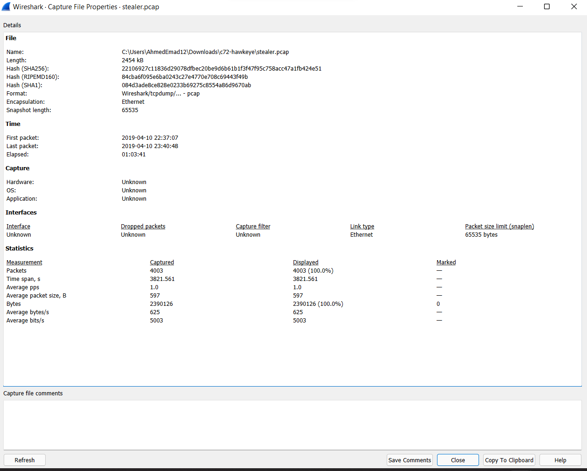

----------------------------------------------------------
**Q2** : At what time was the first packet captured ?

S2 : To set the timezone of Wireshark to UTC, go to View > Time Display Format > UTC Date and Time of Day.

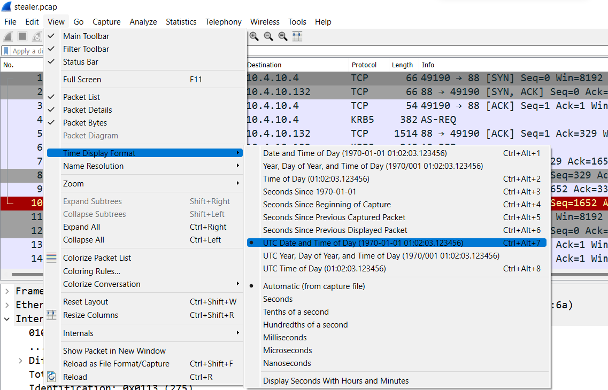

The No. column shows the frame number of the pcap.

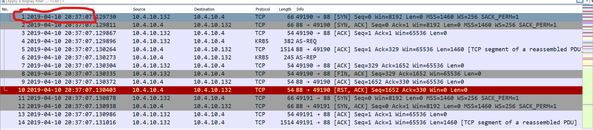

The Time column with frame 1 shows the time of the first packet captured

----------------------------------------------------------------------------
**Q3** : What is the duration of the capture?

S3 :  From Capture File Properties look for Elasped under Time.

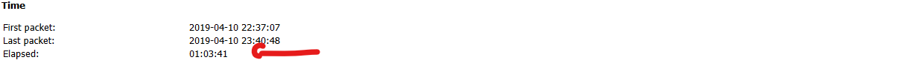

-----------------------------------------------------------------------------
**Q4** : What is the most active computer at the link level?

S4 : To view Ethernet, go to Statistics > Endpoints > Ethernet. Click Packets to sort the packets by descending .

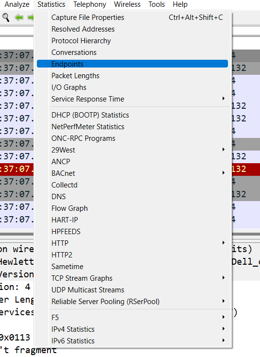

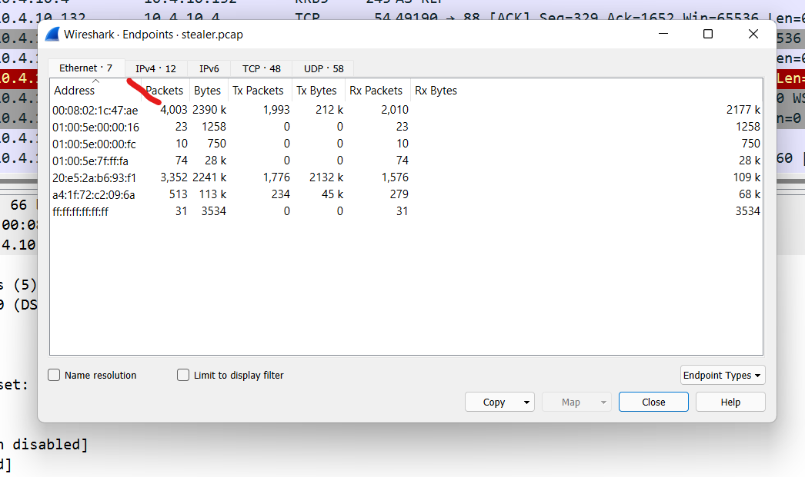

-----------------------------------------------------------------------------

**Q5** : Manufacturer of the NIC of the most active system at the link level?

S5 : Or use a MAC address lookup online. Copy your answer from the previous question and search it on DNSChecker.org .

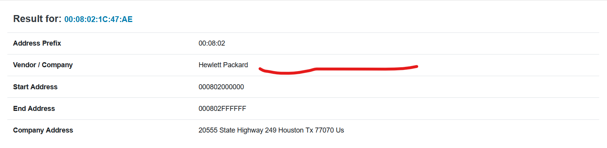

-----------------------------------------------------------------------------

**Q6** : Where is the headquarters of the company that manufactured the NIC of the most active computer at the link level?

S6 : Using Google search engine, the results show the headquarters address of Hewlett Packard .

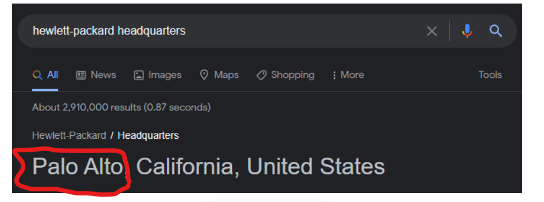

-----------------------------------------------------------------------------

**Q7** : The organization works with private addressing and netmask /24. How many computers in the organization are involved in the capture?

S7 : To view the IPv4 addresses, go to Statistics > Endpoints > IPv4 (Answer = 3)

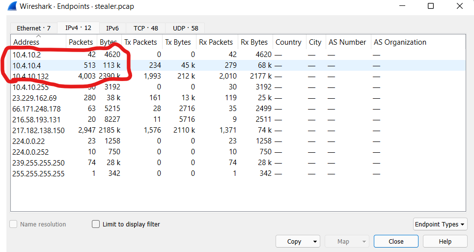

-----------------------------------------------------------------------------

**Q8** : What is the name of the most active computer at the network level?

S8 : DHCP traffic can be used to identify the host information such as MAC Address, IP Address, and Hostname. Since I already know the MAC address, I used it to filter the packets to only display the dhcp traffic from the MAC address 00:08:02:1c:47:ae. 
write in wireshark to filter taffic use this command = eth.addr==00:08:02:1c:47:ae && dhcp ,

Select the first frame and expand Dynamic Host Configuration Protocol and Option (12).

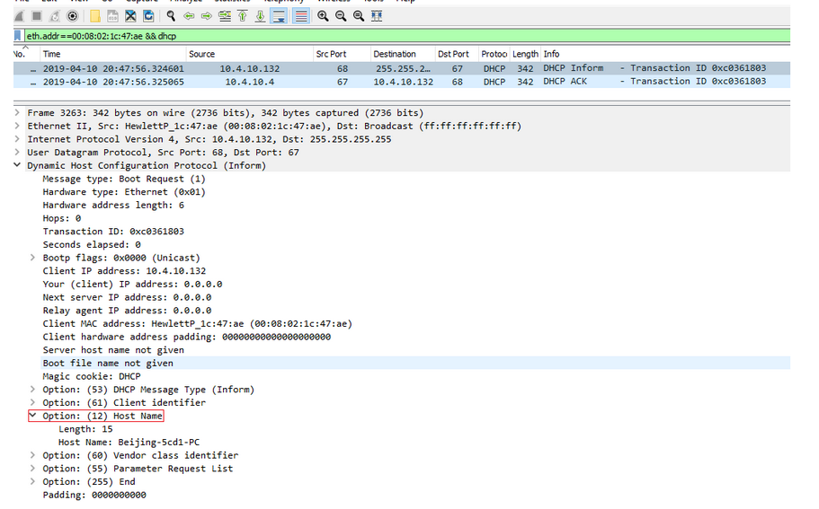

-----------------------------------------------------------------------------

**Q9** : What is the IP of the organization’s DNS server?

S9 : Enter in search bar DNS to filter packets and write IP in Destination Show in first frame (10.4.10.4)

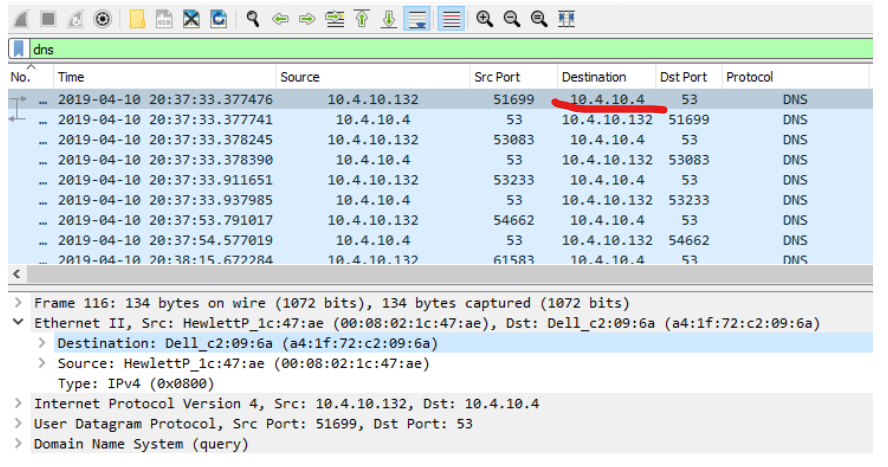

-------------------------------------------------------------------------------

**Q10** : What domain is the victim asking about in packet 204?

S10 : use this command to filter packets to show packet 204 (frame.number==204)
Expanding the Domain Name System and Queries will show the domain that the victim is accessing.

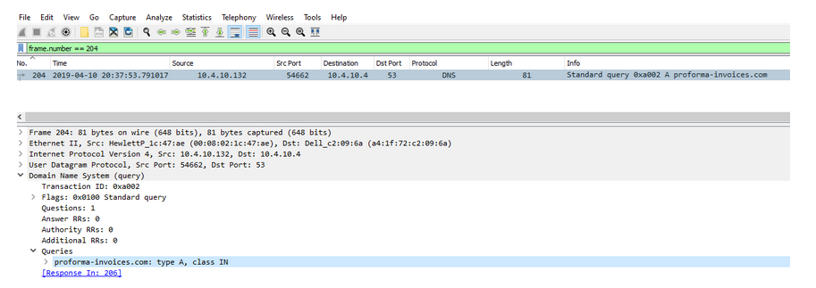

------------------------------------------------------------------------------------

**Q11** : What is the IP of the domain in the previous question?

S11 : add = 217.182.138.132

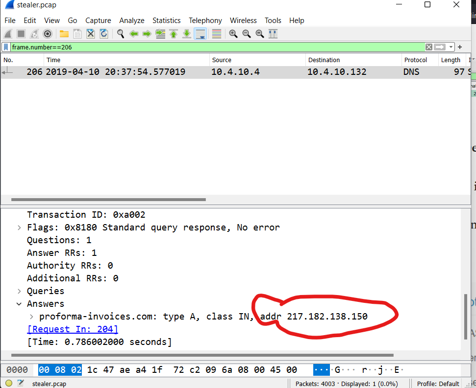

----------------------------------------------------------------------------------------

**Q12** : Indicate the country to which the IP in the previous section belongs

S12 : use website AbusedIPDB to return information about this IP including Location

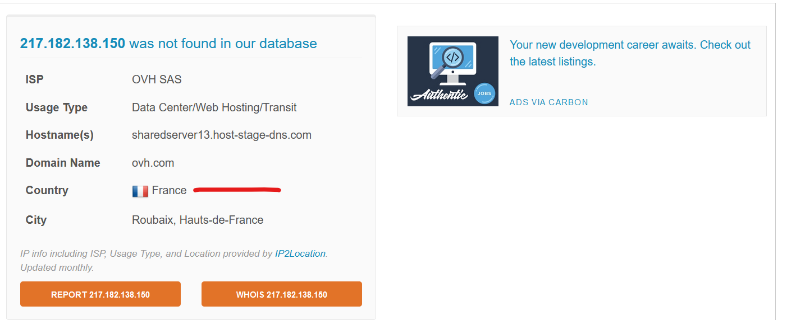

---------------------------------------------------------------------------------------------

**Q13** : What operating system does the victim’s computer run?

S13 : write (ip.addr == 10.4.10.132&&http) to filter packet with this ip then select first packet appear 

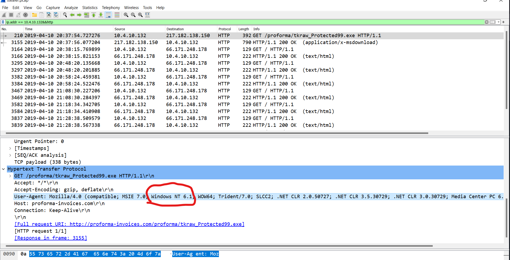

----------------------------------------------------------------------------------------------

**Q14** : What is the name of the malicious file downloaded by the accountant?

S14 :  (http.request.method == GET) this filter will display all the HTTP GET requests.
(and packet 210 show you the file name of malicious file)

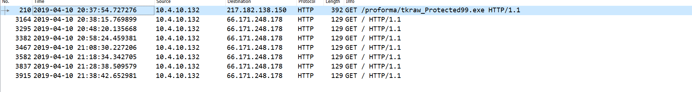

---------------------------------------------------------------------------------------------

**Q15** : What is the md5 hash of the downloaded file?

S15 :  go to File > Export Objects > HTTP.

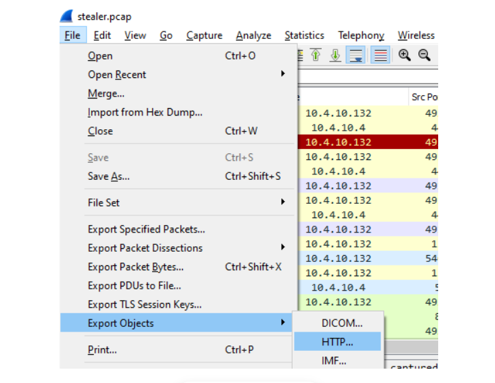

Select Packet 3155 and click the Save button.

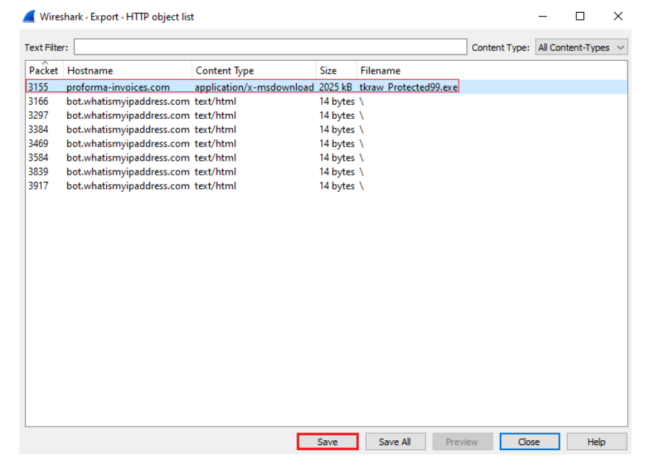

Then I used the certutil command with the -hashfile option to generate the MD5 hash. (certutil -hashfile tkraw_Protected99.exe MD5)

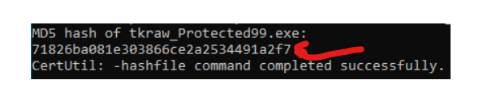

----------------------------------------------------------------------------------------------------------------

**Q16** : What is the name of the malware according to Malwarebytes ?

S16 : Scan the file using its MD5 hash in VirusTotal and look for Malwarebytes results

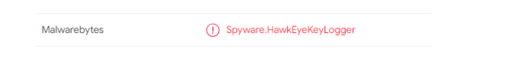

---------------------------------------------------------------------------------------------------------------

**Q17** : What software runs the webserver that hosts the malware?

S17 : The filter (frame contains proforma-invoices.com) will display all the frames with proforma-invoices.com.

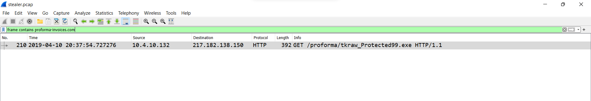

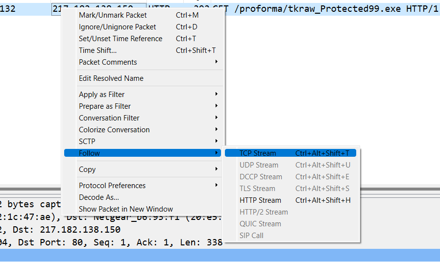

The Server in HTTP header represents the software used by the web server and sometimes it includes the version.

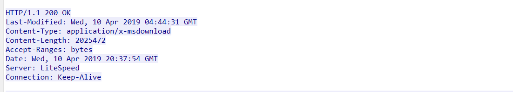

--------------------------------------------------------------------------------------------------------------

**Q18** :  What is the public IP of the victim’s computer?

S18 : write (http.request) then choose packet shows frame 3164 performed a GET request from the host bot.whatismyipaddress.com.

Using the Follow HTTP Stream feature, the HTTP header shows the public IP address of the victim’s computer.

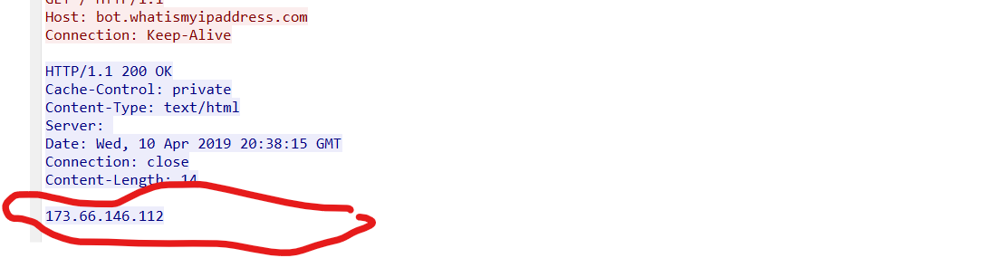

------------------------------------------------------------------------------------------------------

**Q19** : In which country is located the email server to which the stolen information is sent?

S19: (ip.addr == 10.4.10.132 && smtp.req)The filter will display all the smtp requests by the victim’s machine.

AbuseIPDB shows the Country where the IP address is located

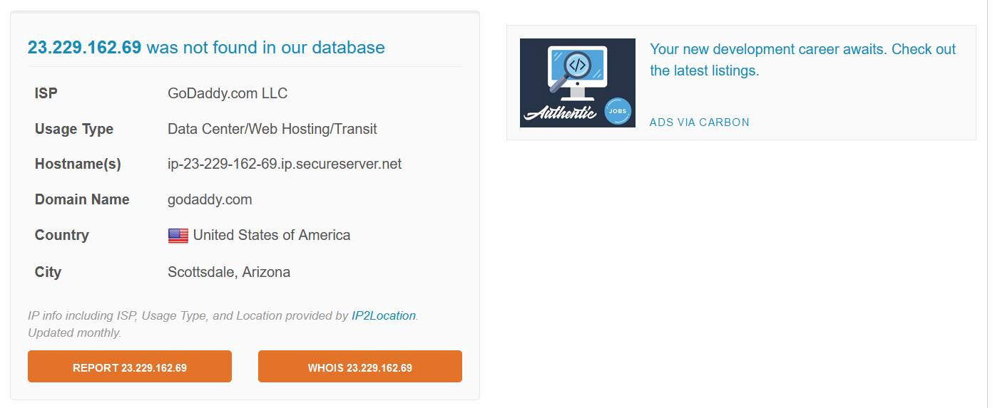

--------------------------------------------------------------------------------------------------------------

**Q20** : What is the creation date of the domain to which the information is exfiltrated?

S20 : (ip.addr == 10.4.10.132 && smtp.req) , Select the first frame from the results on the filter below and use the Follow TCP Stream option.

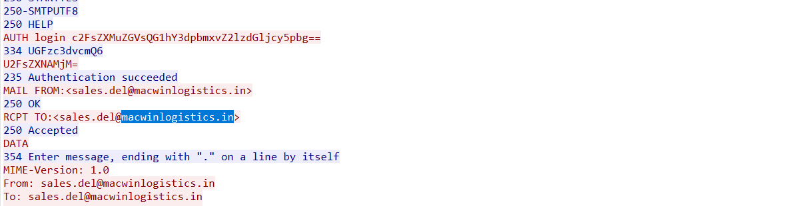

The image above shows the email domain. Now that I know the domain, I used an online tool called Whois, the results show the information of the domain including its creation date.

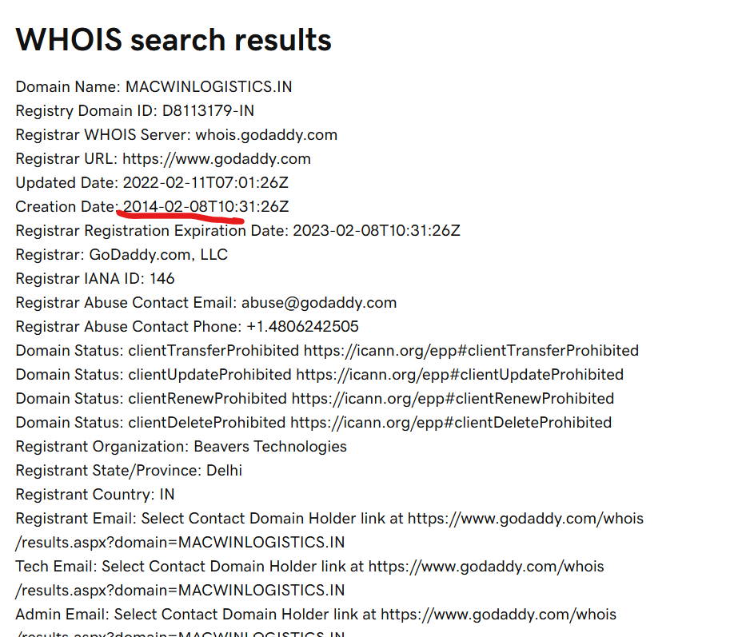

------------------------------------------------------------------------------------------------------

**Q21** : Analyzing the first extraction of information. What software runs the email server to which the stolen information is sent?

S21 : The same steps from the previous question on viewing the smtp traffic. The first line on the image below shows the software used and its version

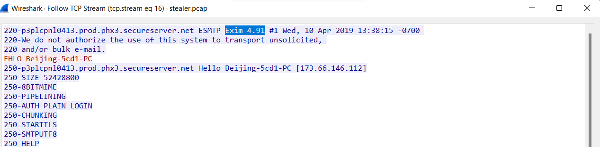

----------------------------------------------------------------------------------------------------------------

**q22** : To which email account is the stolen information sent?

S22 : show follow TCP stream for first frame use SMTP protocol 

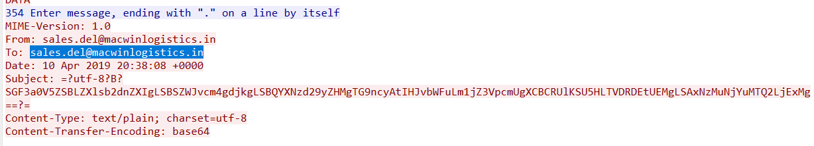

--------------------------------------------------------------------------------------------------------------------

**Q23** : What is the password used by the malware to send the email?

S23 : use this command (ip.addr == 10.4.10.132 && smtp.req) 

Selecting frame 3182 and expanding Application Layer/Simple Mail Transfer Protocol shows the password and it is encoded with base64.

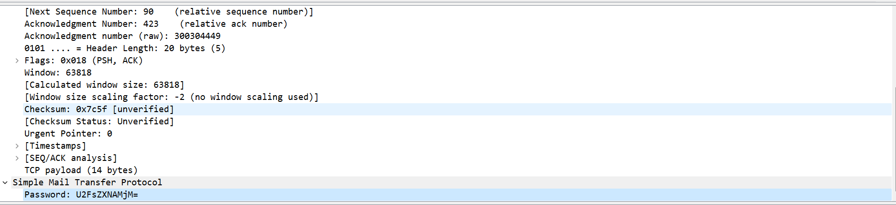

CyberChef can be used to decode the password with From Base64 operation

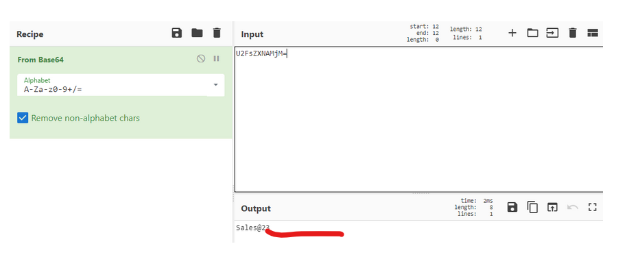

---------------------------------------------------------------------------------------

**Q24** : Which malware variant exfiltrates information?

S24 : Using the Follow TCP stream option from one of the smtp requests, smtp traffic shows that the content is encoded with base64.

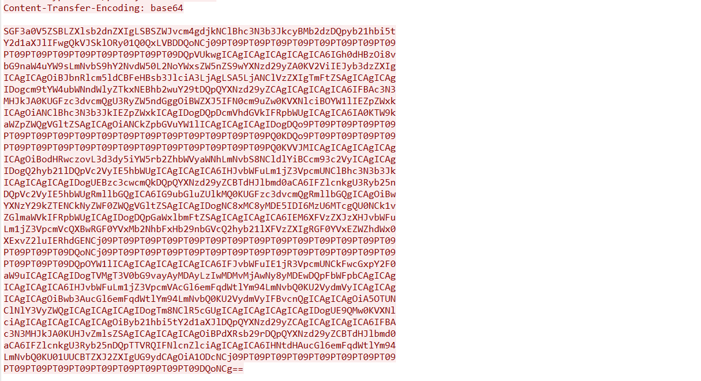

CyberChef shows the human-readable format of the email body.

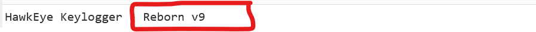

---------------------------------------------------------------------------------------------

**Q25** : What are the bankofamerica access credentials? Username:password

S25 : The output from the previous question shows several information including the URL, Username, and Password ()

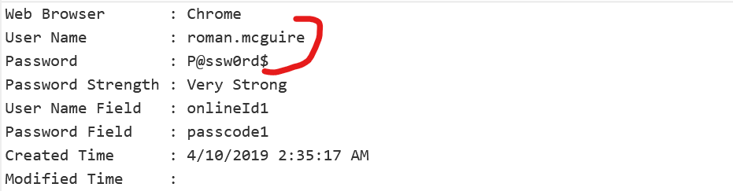

----------------------------------------------------------------------------------

**Q26** : Every how many minutes is the information collected exfiltrated?

S26 : Entering smtp on the filter field to display only the smtp traffic. Providing some of the traffic when the email content (email headers + body) was sent, it shows that it was sent every 10 minutes

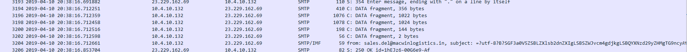

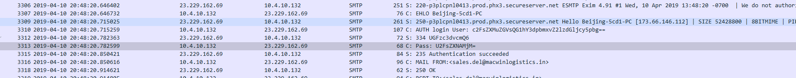

-----------------------------------------------------------------------------------------------

